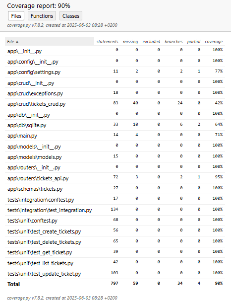

# Tickets management with FastAPI


##  Description

This is a FastAPI application for managing tickets using an asynchronous SQLite database with SQLAlchemy in async mode. 
A docker-compose file is included to easily run the application inside a Docker container while persisting data in the database.
### Directory Structure
```
ticket-management
├── app
│   ├── config
│   │   └── settings.py
│   ├── crud
│   │   ├── exceptions.py
│   │   └── tickets_crud.py
│   ├── db
│   │   └── sqlite.py
│   ├── models
│   │   └── models.py
│   ├── routes
│   │   └── tickets_api.py
│   ├── schemas
│   │   └── tickets.py
│   ├── __init__.py
│   └── main.py
├── tests
│   ├── integration
│   │   ├── conftest.py
│   │   └── test_integrations.py
│   ├── integration
│   │   ├── conftest.py
│   │   ├── test_create_tickets.py
│   │   ├── test_delete_tickets.py
│   │   ├── test_get_ticket.py
│   │   ├── test_list_tickets.py
│   │   └── test_update_ticket.py
├── Dockerfile
├── README.md
├── docker-compose.yaml
├── requirements.txt
├── pyproject.toml
└── .env
```
We can find the following files :
- settings.py : Contains the SQLite configuration, including the database URI.
- sqlite.py : Defines three main functions: one to create the SQLite connection, one to close it, and one to retrieve a database session.
- tickets_crud.py : Contains the core CRUD operations used to create, read, update, and delete ticket resources in the SQLite database.
- exceptions.py : Defines custom exception classes used throughout the application.
- models.py: Contains the SQLAlchemy model for the Ticket entity.
- schema/tickets.py : Defines the Pydantic models used for data validation and serialization.
- tickets_api.py : Implements the FastAPI routes for managing tickets.
- test_integration.py : Contains integration tests for the FastAPI routes.
- test/unit/ : Contains unit tests for various components of the application.
- conftest.py : Defines shared test fixtures used in both unit and integration tests.
- main.py : The main entry point of the FastAPI application.
- .env : Stores environment variables, including the path to the SQLite database.
- pyproject.toml: Configures project tools like Ruff for linting, formatting, and import sorting.

### API Routes Overview
| Method | Path                         | Description           |
|--------|------------------------------|-----------------------|
| POST   | `/tickets/`                  | Create a new ticket   |
| GET    | `/tickets/`                  | List all tickets      |
| GET    | `/tickets/{ticket_id}`       | Retrieve ticket by ID |
| PUT    | `/tickets/{ticket_id}`       | Update a ticket by ID |
| PATCH  | `/tickets/{ticket_id}/close` | Close a ticket        |
| DELETE | `/tickets/{ticket_id}`       | Delete a ticket       |
| DELETE | `/tickets/`                  | Delete all tickets    |

##  Getting Started

To run this FastAPI application, you should first clone the project to your local machine using the following command:
```bash
git clone https://github.com/zakariasaoud/tickets-management.git
```
After cloning the project, there are two possible ways to start the application:

#### Method 1 – Starting the Uvicorn server locally:
In this method, you'll create and activate a Python virtual environment, install the dependencies from requirements.txt, and then run the Uvicorn server.

```shell script
# Navigate to the project root directory
cd tickets-management

# Create a Python virtual environment
python -m venv venv

# Activate the virtual environment (Windows)
.\venv\Scripts\activate.bat

# (For Linux/macOS, use: source venv/bin/activate)

# Install dependencies
pip install -r requirements.txt

# Run the Uvicorn server with autoreload
uvicorn app.main:app --reload
```
Afterward, the project will be live at [http://localhost:8000](http://localhost:8000).

#### Method 2 – Using Docker Compose:
This method requires Docker to be installed on your machine. It will build and run containers for the FastAPI app and the database, with data persistence inside the database container.

```shell script
# Navigate to the project root directory
cd tickets-management

# Run Docker Compose to start the application and its dependencies
docker-compose up --build web
```
**Note:** To relaunch the project in subsequent runs, use:

```bash
docker-compose run web
```
Afterward, the project will be live at [http://localhost:8000](http://localhost:8000).

## Documentation

FastAPI automatically generates documentation based on the specifications of the endpoints that we have defined. 
You can access the interactive API documentation here:

- **Swagger UI:** [http://localhost:8000/docs](http://localhost:8000/docs),
an interactive, web-based interface to explore and test the API endpoints with live requests.

- **ReDoc:** [http://localhost:8000/redoc](http://localhost:8000/redoc), 
a clean, readable API reference documentation designed for easy navigation and overview.

In this section, we document the main routes available in the application, including their methods, paths, and example usages. 
Feel free to use Postman or curl to test the various API routes. 


### ❯ `POST /tickets/`

Create a new ticket by providing a title. Description and status are optional.

- **Summary:** Create a new ticket  
- **Status Code:** `201 Created`  
- **Query Parameter:**  
  - `reject_duplicates` (bool, optional): Prevents creating tickets with the same title. Default: `false`.

#### 🔗 Example Request URL
```bash
POST http://localhost:8000/tickets/?reject_duplicates=false
```

#### 🔗 Request Body (JSON)
```json
{
  "title": "Server down",
  "description": "The API server is not responding",
  "status": "open"
}
```

#### 🔗 Example `curl` Command
```curl -X POST "http://localhost:8000/tickets/?reject_duplicates=false" \
  -H "Content-Type: application/json" \
  -d '{
    "title": "Server down",
    "description": "The API server is not responding",
    "status": "open"
}'
```

### ❯ `GET /tickets/`

List all tickets with optional pagination.

- **Summary:** List all tickets  
- **Description:** Retrieve tickets with optional `skip` and `limit` query parameters to control pagination.  
- **Status Code:** `200 OK`  
- **Query Parameters:**  
  - `skip` (int, optional, default: 0): Number of tickets to skip. Must be ≥ 0.  
  - `limit` (int, optional, default: 10): Maximum number of tickets to return. Must be between 0 and 100.

#### 🔗 Example Request URL
```bash
GET http://localhost:8000/tickets/
```

#### 🔗 Response (200 OK)
```json
{
  "tickets": [
    {
      "id": 1,
      "title": "Server down",
      "description": "The API server is not responding",
      "status": "open",
      "created_at": "2025-06-02T14:32:10.123Z"
    },
    {
      "id": 2,
      "title": "Login issue",
      "description": "Cannot login with valid credentials",
      "status": "closed",
      "created_at": "2025-06-03T09:15:45.456Z"
    }
  ],
  "total": 2,
  "skip": 0,
  "limit": 10
}
```

#### 🔗 Example `curl` Command
`curl -X GET "http://localhost:8000/tickets/" \
  -H "Accept: application/json"
`


### ❯ `GET /tickets/{ticket_id}`

Retrieve a ticket by its unique ID.

- **Summary:** Get a ticket from its ID  
- **Description:** Fetch the details of a specific ticket using its UUID.  
- **Status Code:** `200 OK`  
- **Path Parameter:**  
  - `ticket_id` (UUID): The unique identifier of the ticket.

#### 🔗 Example Request URL
```bash
GET http://localhost:8000/tickets/12345678-1234-5678-1234-567812345679
```

#### 🔗 Example `curl` Command
`curl -X GET "http://localhost:8000/tickets/12345678-1234-5678-1234-567812345679" \
  -H "Accept: application/json"`  

### ❯ `PUT /tickets/{ticket_id}`

Update an existing ticket by its unique ID.

- **Summary:** Update a ticket from its ID  
- **Description:** Modify ticket details for a given ticket ID.  
- **Status Code:** `200 OK`  
- **Path Parameter:**  
  - `ticket_id` (UUID): The unique identifier of the ticket to update.

#### 🔗 Example Request URL
```bash
PUT http://localhost:8000/tickets/12345678-1234-5678-1234-567812345679
```

#### 🔗 Request Body (JSON)

```json
{
  "description": "The API server is responding now",
  "status": "closed"
}
```

#### 🔗 Example `curl` Command
```
curl -X PUT "http://localhost:8000/tickets/12345678-1234-5678-1234-567812345679" \
  -H "Content-Type: application/json" \
  -d '{
    "description": "The API server is responding now",
    "status": "closed"
}'
```

### ❯ `PATCH /tickets/{ticket_id}/close`

Close an existing ticket by its unique ID.

- **Summary:** Close a ticket  
- **Description:** Mark the ticket as closed by its ID.  
- **Status Code:** `200 OK`  
- **Path Parameter:**  
  - `ticket_id` (UUID): The unique identifier of the ticket to close.

#### 🔗 Example Request URL
```bash
PATCH http://localhost:8000/tickets/12345678-1234-5678-1234-567812345679/close
```

#### 🔗 Example `curl` Command
`curl -X PATCH "http://localhost:8000/tickets/12345678-1234-5678-1234-567812345679/close"`

### ❯ `DELETE /tickets/{ticket_id}`

Delete a ticket by its unique ID.

- **Summary:** Delete a ticket  
- **Description:** Delete a ticket that is already closed. Use the `force_delete` query parameter to delete regardless of status.  
- **Status Code:** `204 No Content` (on successful deletion)  
- **Path Parameter:**  
  - `ticket_id` (UUID): The unique identifier of the ticket to delete.  
- **Query Parameter:**  
  - `force_delete` (bool, optional, default: false): Force deletion even if the ticket is not closed.

#### 🔗 Example Request URL
```bash
DELETE http://localhost:8000/tickets/12345678-1234-5678-1234-567812345679?force_delete=True
```

#### 🔗 Example `curl` Command
`curl -X DELETE "http://localhost:8000/tickets/12345678-1234-5678-1234-567812345679?force_delete=True"`


### ❯ `DELETE /tickets/`

Delete all tickets, with option to force delete regardless of status.

- **Summary:** Delete all tickets  
- **Description:** Delete all closed tickets. Use the `force_delete` query parameter to delete all tickets regardless of their status.  
- **Status Code:** `200 OK`  
- **Query Parameter:**  
  - `force_delete` (bool, optional, default: false): Force deletion of all tickets regardless of status.

#### 🔗 Example Request URL
```bash
DELETE http://localhost:8000/tickets/?force_delete=True
```

#### 🔗 Example `curl` Command
`curl -X DELETE "http://localhost:8000/tickets/?force_delete=True"`


## Testing
### 🔧 Unit Tests:
You can run the unit tests using the following command:

```bash
pytest .\tests\unit --disable-warnings
```

### 🛠️ Integration Tests:
You can run the integration tests using the following command:
```bash
pytest -s -v .\tests\integration --disable-warnings
```

**Note:** You can run both the unit and integration tests together using the following command:
```bash
pytest .\tests --disable-warnings
```

### 📊 Running Tests with Coverage

The current test coverage is 90%. Click below to view the test coverage screenshot for the project:

<details>
<summary>🧪 Test Coverage Screenshot</summary>



</details>


To run all tests with coverage reporting, you can use the following commands:

```bash
coverage run --branch -m pytest tests/
coverage report -m
coverage html
```

## 🧹 Code Style

This project uses [Ruff](https://docs.astral.sh/ruff/) for Python linting (PEP8 compliance, import sorting, etc.).

### Running Ruff

To check code quality (lint):

```bash
ruff check .
```

### Format code 

To reformat the Python files according to Ruff’s rules:

```bash
ruff format .
```
