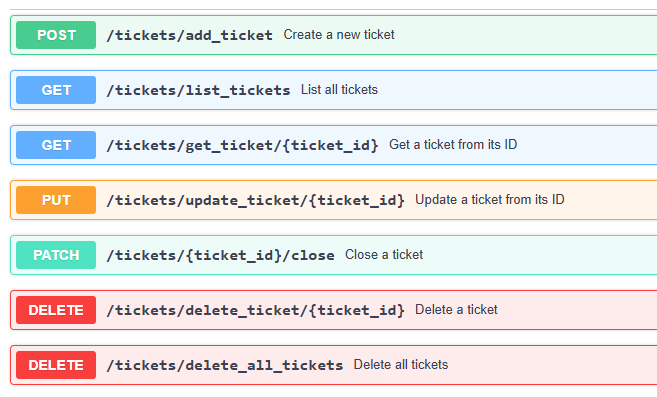

# Tickets management with FastAPI


##  Description

This is a FastAPI application for managing tickets using an asynchronous SQLite database with SQLAlchemy in async mode. 
A docker-compose file is included to easily run the application inside a Docker container while persisting data in the database.
### Directory Structure
```
FastApiEvents
├── app
│   ├── config
│   │   └── settings.py
│   ├── crud
│   │   ├── exceptions.py
│   │   └── tickets_crud.py
│   ├── db
│   │   └── sqlite.py
│   ├── models
│   │   └── models.py
│   ├── routes
│   │   └── tickets_api.py
│   ├── schemas
│   │   └── tickets.py
│   ├── __init__.py
│   └── main.py
├── tests
│   ├── integration
│   │   ├── conftest.py
│   │   └── test_integrations.py
│   ├── integration
│   │   ├── conftest.py
│   │   ├── test_create_tickets.py
│   │   ├── test_delete_tickets.py
│   │   ├── test_get_ticket.py
│   │   ├── test_list_tickets.py
│   │   └── test_update_ticket.py
├── Dockerfile
├── README.md
├── docker-compose.yaml
├── requirements.txt
└── .env
```
We can find the following files :
- settings.py : Contains the SQLite configuration, including the database URI.
- sqlite.py : Defines three main functions: one to create the SQLite connection, one to close it, and one to retrieve a database session.
- tickets_crud.py : Contains the core CRUD operations used to create, read, update, and delete ticket resources in the SQLite database.
- exceptions.py : Defines custom exception classes used throughout the application.
- models.py: Contains the SQLAlchemy model for the Ticket entity.
- schema/tickets.py : Defines the Pydantic models used for data validation and serialization.
- tickets_api.py : Implements the FastAPI routes for managing tickets.
- test_integration.py : Contains integration tests for the FastAPI routes.
- test/unit/ : Contains unit tests for various components of the application.
- conftest.py : Defines shared test fixtures used in both unit and integration tests.
- main.py : The main entry point of the FastAPI application.
- .env : Stores environment variables, including the path to the SQLite database.

### API routes



##  Getting Started

To run this FastAPI application, you should first clone the project to your local machine using the following command:
```bash
git clone https://github.com/zakariasaoud/tickets-management.git
```
After cloning the project, there are two possible ways to start the application:

#### 1 - Starting the uvicorn server in your local machine:
In this method, you need to create and activate a Python virtual environment, 
install the dependencies from requirements.txt, and then run the Uvicorn server.

```shell script
# Navigate to the project root directory
cd tickets-management

# Create a Python virtual environment
python -m venv venv

# Activate the virtual environment (Windows)
.\venv\Scripts\activate.bat

# (For Linux/macOS, use: source venv/bin/activate)

# Install dependencies
pip install -r requirements.txt

# Run the Uvicorn server with autoreload
uvicorn app.main:app --reload
```

#### 2 - Using the docker compose file:
This method requires Docker installed on your machine. It will build and run containers for the FastAPI app and the database. 
Using Docker allows data to persist inside the database container.

```shell script
# cd into project root
cd tickets-management

# Run Docker Compose to start the application and its dependencies
docker-compose up --build web

# Launch the project again (for subsequent runs)
docker-compose run web
```

Afterward, the project will be live at [http://localhost:8000](http://localhost:8000).

## Documentation

FastAPI automatically generates documentation based on the specifications of the endpoints you’ve defined. 
You can access the interactive API documentation at http://localhost:8000/docs.
You can also use Postman to test the different routes. For example:


## Testing
### 🔧 Unit Tests:
You can run the unit tests using the following command:

```bash
pytest .\tests\unit --disable-warnings
```

### 🔗 Integration Tests:
You can run the integration tests using the following command:
```bash
pytest -s -v .\tests\integration --disable-warnings
```

**Note:** You can run both the unit and integration tests together using the following command:
```bash
pytest .\tests --disable-warnings
```

### 📊 Running Tests with Coverage


The current test coverage is 90%. To run all tests with coverage reporting, you can use the following commands:

```bash
coverage run --branch -m pytest tests/
coverage report -m
coverage html
```
